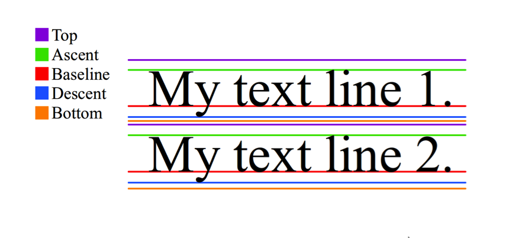

title:: TextView Line Height

- [[Mar 14th, 2022]]
- ## Text View Structure
	- 
	- OneLine TextView Case
		- Text Height = Ascent - Descent
		- Line height = Top - Bottom = Text Height + font padding
	- TwoLine TextView Case
		- Line Height = Text Height * 2 + font padding
		-
	-
-
- Reference:
	- [神奇的TextView](https://codeantenna.com/a/qTS5cygDkQ)
	-
-