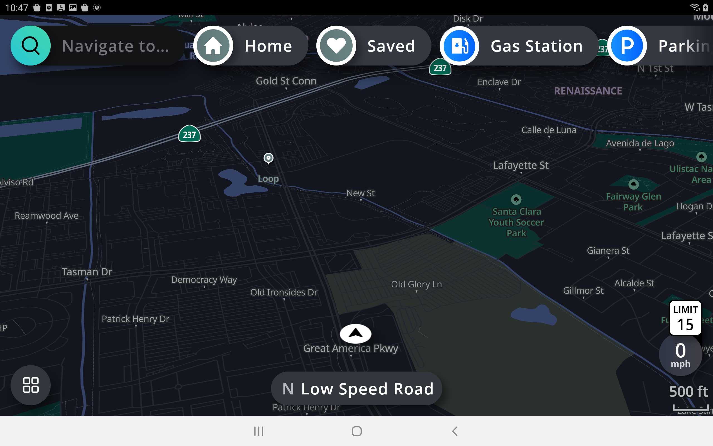
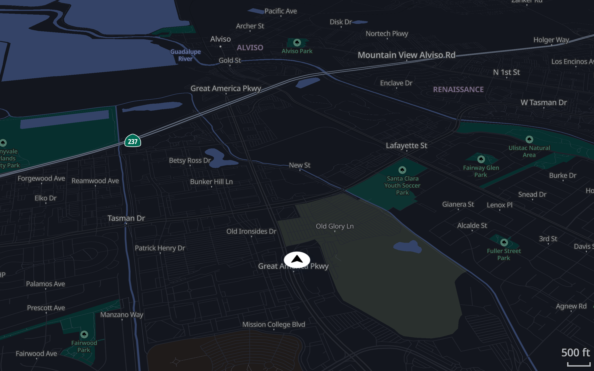
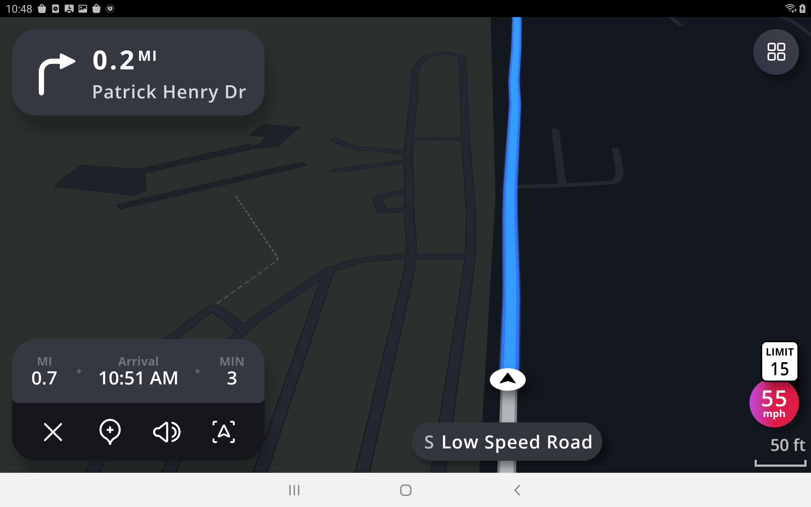
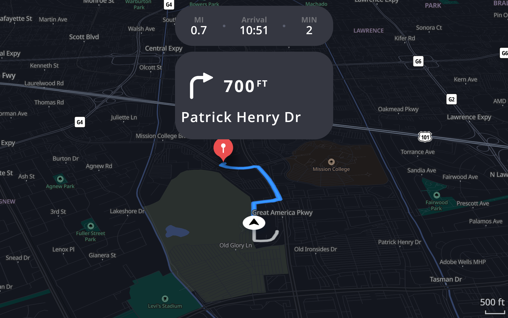

- [[May 7th, 2022]]
- 10:54
- ## IGV Mode
	- ### Main Screen
	- 
	- ### Cluster
	- 
- ## AGV
	- ### Main Screen
	- 
	- ### Cluster
	- 
- ### ADB Command
- ```
  - adb shell screencap -d 0 -p /sdcard/main_screen_igv.png
  - adb shell screencap -d 1 -p /sdcard/cluster_screen_igv.png
  - scrcpy --display 0 // cast main screen to PC
  - scrcpy --display 11 // cast cluster screen to PC
  ```
-