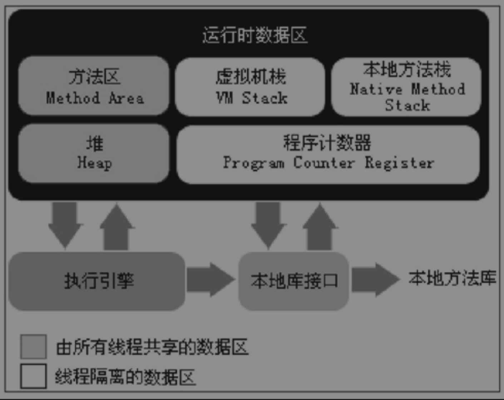

- [[Mar 17th, 2022]]
- ## 运行时数据区域 #card
  card-last-interval:: 4
  card-repeats:: 1
  card-ease-factor:: 2.6
  card-next-schedule:: 2022-03-21T05:09:12.958Z
  card-last-reviewed:: 2022-03-17T05:09:12.959Z
  card-last-score:: 5
	-  #Contents
	-
	-
- ## 程序计数器
	- 较小的内存空间
	- 当前线程的字节码行号指示器